<p align="center">
  
</p>

<h1 align="center">🔥 DeadZone GamingPlus 🔥</h1>

<h3 align="center">
  Xiaomi HyperOS / MIUI ROM Build System • Automated ROM Factory • By MEZO
</h3>

<p align="center">
  <a href="https://t.me/xDeadZoneh">
    
  </a>
  <a href="https://github.com/hypermezo4-create/game_xiaomi-toolbuild">
    
  </a>
  
  
</p>

<p align="center">
  
  
  
  
  
</p>

<p align="center">
  
</p>

---

## 🧬 Project DNA

<table>
<tr>
<td width="50%">

### 🔥 Brand

```txt
DeadZone By MEZO
```

A clean and powerful ROM automation identity focused on speed, structure, and reliable release delivery.

</td>
<td width="50%">

### 🎮 Default Edition

```txt
GamingPlus
```

A performance-focused build style designed for users who want a clean, enhanced Xiaomi ROM experience.

</td>
</tr>
<tr>
<td width="50%">

### 📱 Target Devices

```txt
Xiaomi / Redmi / POCO
```

Built for Xiaomi ecosystem devices using HyperOS or MIUI base packages.

</td>
<td width="50%">

### ⚙️ Build System

```txt
GitHub Actions + Linux Toolchain
```

Automated extraction, patching, repacking, upload, and notification workflow.

</td>
</tr>
</table>

---

## 🧠 Overview

**DeadZone GamingPlus** is a Xiaomi ROM build and automation system created by **MEZO**.

It is designed to process Xiaomi HyperOS / MIUI base ROM packages, extract system partitions, apply DeadZone GamingPlus modifications, repack the ROM, generate a flashable ZIP, upload the final build to Google Drive, and send build status through Telegram workflows.

> **Build clean. Patch smart. Release with confidence.**

---

## 🚀 Build Pipeline

```mermaid
flowchart LR
    A[ROM Link] --> B[Download Base ROM]
    B --> C[Detect ROM Type]
    C --> D[Extract Payload / Super]
    D --> E[Extract Dynamic Partitions]
    E --> F[Apply GamingPlus Mods]
    F --> G[Patch Framework / SystemUI]
    G --> H[Repack Images]
    H --> I[Generate Flashable ZIP]
    I --> J[Upload to Google Drive]
    J --> K[Telegram Notification]
```



---

## ✨ Feature Matrix

<table>
<tr>
<td width="33%">

### 📦 ROM Input

- Direct OTA ROM links
- Payload-based ROM packages
- `payload.bin` support
- `super.img` support
- HyperOS / MIUI packages

</td>
<td width="33%">

### 🛠️ Processing

- Device codename detection
- Android version detection
- ROM region parsing
- EROFS / EXT support
- Dynamic partition extraction

</td>
<td width="33%">

### ☁️ Release

- Final ZIP generation
- SHA256 output
- Google Drive upload
- Per-device folders
- Telegram build status

</td>
</tr>
</table>

---

## 🎮 GamingPlus Direction

```txt
ROM Automation            ████████████████████
Gaming Experience         ███████████████████░
Performance Tweaks        ███████████████████░
HyperOS Customization     ███████████████████░
Cloud Release Pipeline    ███████████████████░
Telegram Workflow         ██████████████████░░
```

---

## 🧩 Supported ROM Layouts

| ROM Layout | Status | Notes |
|---|---:|---|
| Recovery OTA ZIP | ✅ | Standard Xiaomi OTA package |
| Payload ROM | ✅ | Extracts `payload.bin` |
| Dynamic Partitions | ✅ | Handles dynamic partition images |
| `super.img` ROM | ✅ | Supports super-based packages |
| HyperOS | ✅ | HyperOS ROM workflow |
| MIUI | ✅ | MIUI ROM workflow |

---

## 📁 Output Naming

Final builds follow the DeadZone GamingPlus naming format:

```txt
DeadZone_GamingPlus_<VERSION>_<CODENAME>_<ROM_VERSION>_<REGION>-A<ANDROID>.zip
```

Example:

```txt
DeadZone_GamingPlus_V1.06_ZIRCON_OS3.0.303.0.WNOCNXM_ChinaStable-A16.zip
```

---

## ☁️ Upload Structure

Final ROMs are organized by device codename:

```txt
DeadZoneBuilds/
└── GamingPlus/
    ├── ZIRCON/
    ├── PRAGUE/
    └── FUXI/
```

---

## 🛠️ Toolchain

<p align="center">
  
</p>

<table>
<tr>
<td width="50%">

### Core Tools

- Bash
- Python 3
- Java
- Git
- GitHub Actions
- zip / unzip
- 7z
- curl
- aria2c
- zstd

</td>
<td width="50%">

### Android Image Tools

- payload extractor
- lpmake
- lpunpack
- mkfs.erofs
- fs_config handling
- file_contexts handling
- dynamic partition tools
- image patch utilities

</td>
</tr>
</table>

---

## 📡 Telegram Workflow

<table>
<tr>
<td align="center" width="25%">

### 📥 Request

ROM link received from supported workflow input.

</td>
<td align="center" width="25%">

### ⚙️ Build

GitHub Actions starts the automated build process.

</td>
<td align="center" width="25%">

### ☁️ Upload

Final ZIP is uploaded to Google Drive.

</td>
<td align="center" width="25%">

### ✅ Release

Build metadata and link are sent through Telegram.

</td>
</tr>
</table>

---

## 🧾 Build Metadata

| Metadata | Purpose |
|---|---|
| Device codename | Verifies the correct target device |
| ROM version | Identifies the base package |
| Android version | Shows Android base |
| Region | Shows ROM release region |
| SHA256 | Verifies final ZIP integrity |
| File size | Helps users confirm the download |
| Drive link | Provides final build access |

---

## 🧪 Safety Notes

> Custom ROM building and flashing can be risky. Always verify the target device and base ROM before flashing.

- Use trusted ROM sources only.
- Prefer direct Xiaomi ROM links whenever possible.
- Always verify the device codename.
- Bootloader must be unlocked.
- Back up your data before flashing.
- Do not flash builds on unsupported devices.
- Flashing is always at your own risk.

---

## ⚠️ Disclaimer

This project is provided for educational, development, and ROM automation purposes only.

The developer is not responsible for bricked devices, bootloops, data loss, incorrect flashing, unsupported device usage, failed modifications, or damaged partitions.

---

## 👑 Credits

<table>
<tr>
<td align="center" width="50%">

### 🔥 Project

**DeadZone GamingPlus**

Premium Xiaomi HyperOS / MIUI ROM automation.

</td>
<td align="center" width="50%">

### 👑 Creator

**MEZO**

DeadZone ROM ecosystem builder and maintainer.

</td>
</tr>
</table>

---

<p align="center">
  <a href="https://t.me/xDeadZoneh">
    
  </a>
  <a href="https://github.com/hypermezo4-create">
    
  </a>
</p>

<p align="center">
  <b>DeadZone By MEZO</b>
</p>

<p align="center">
  
</p>
